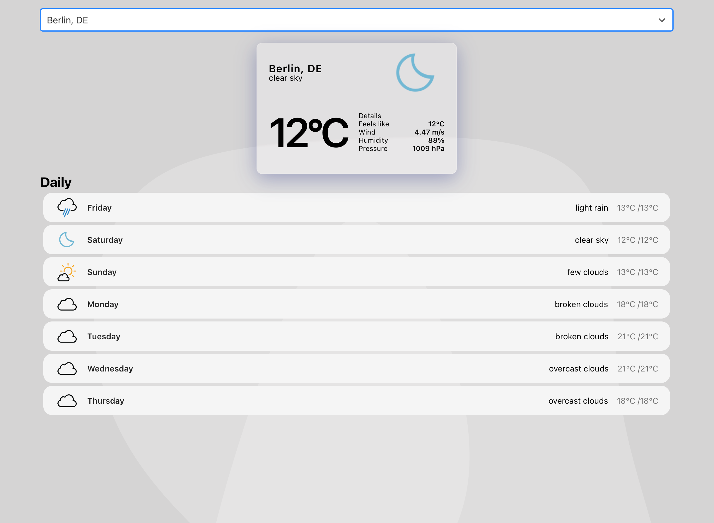

# React Weather App



## Overview

The React Weather App is a web application that provides real-time weather information and forecasts for cities around the world. It allows users to search for cities, view current weather conditions, and access a 7-day weather forecast.

This project was built using React.js and integrates with the OpenWeatherMap API for weather data. The app also utilizes RapidAPI for geolocation, ensuring accurate and reliable weather information.

## Features

- **City Search:** Users can search for cities and get real-time weather details for the selected location.
- **7-Day Forecast:** The application displays a 7-day weather forecast, including temperature highs and lows, descriptions, and more.
- **Detailed Information:** Users can access detailed weather information such as feels-like temperature, wind speed, humidity, pressure, and cloud cover.
- **Background Effects:** The app incorporates SVG backgrounds that dynamically interact with the weather data, creating an engaging and visually appealing user interface.

## Installation

1. Clone the repository to your local machine.

   ```bash
   git clone https://github.com/your-username/weather-react-app.git
